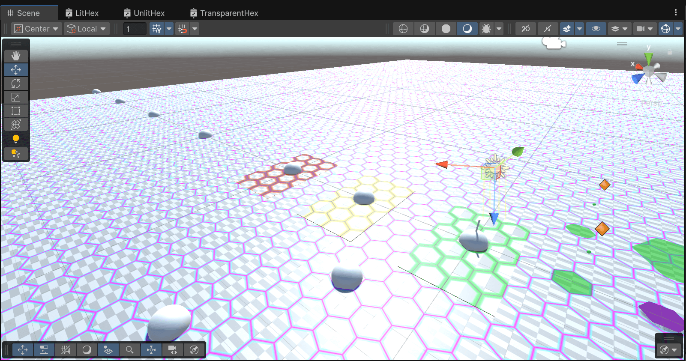

# HexPlaneTest

Custom shaders (and other assets) to display hexagonal grids.

## Assets

### Models

`simple_hex.fbx` contains 2 hexagon meshes -- one sized to fit _around_ unit circle, the other to fit _inside_ of it (unit circle).

### Shaders

`.shader` files are for projector materials -- to add hexagonal grids "externally", not affecting the actual material settings on the renderers.

`.shadergraph` files are for actual objects -- to "embed" hexagonal grid into the "floor" object itself.

`.shadersubgraph` files have reusable parts. Have the core logic of generating tileable hexagonal grid. Can be used to build more complete PBR shader. Line width and 2-color gradient are adjustable.

### Textures

Few PNG textures for projector materials. Tileable of different widths and/or colors.

## Samples

### Projectors Demo

Using projectors. Can affect multiple level elements in the same way.

.

### Shaded Materials Demo

Using shader graph to add hexagons to a specific surface via designated material.

| Illustration | Description |
| --- | --- |
|  | Scene with "sun" ON |
|  | Scene "sun" OFF |
|  | Scene as seen against the "sunlight" |

^ lit materials settings:

| Material | Hex tiling | Base tiling | Emission | Alpha coords | Color coords |
| --- | --- | --- | --- | --- | --- |
| Large floor | 100 | (100, 433) | 0 | (0.2, 0.8) | (0, 0.6) |
| Green, Yellow | 3 | (3, 3) | 0.6 | (0, 0.9) | (0, 0.32) |

Red -- unlit, (3, 3) hex tiling, transparent.
