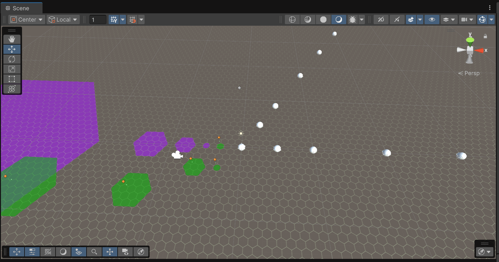
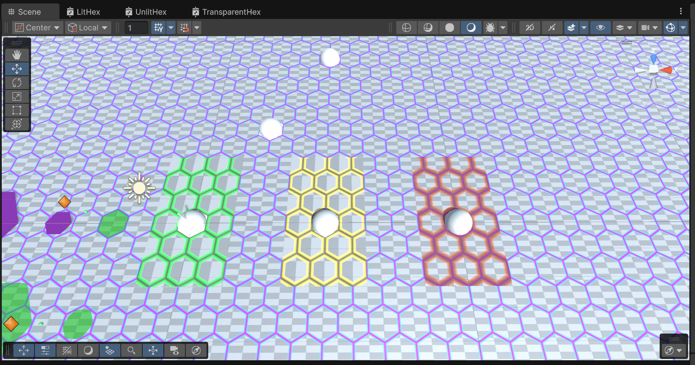
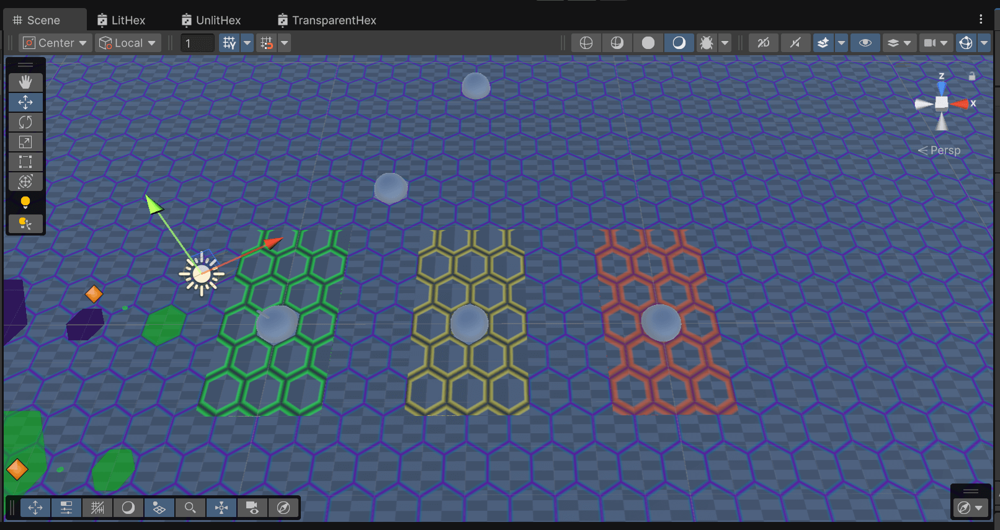
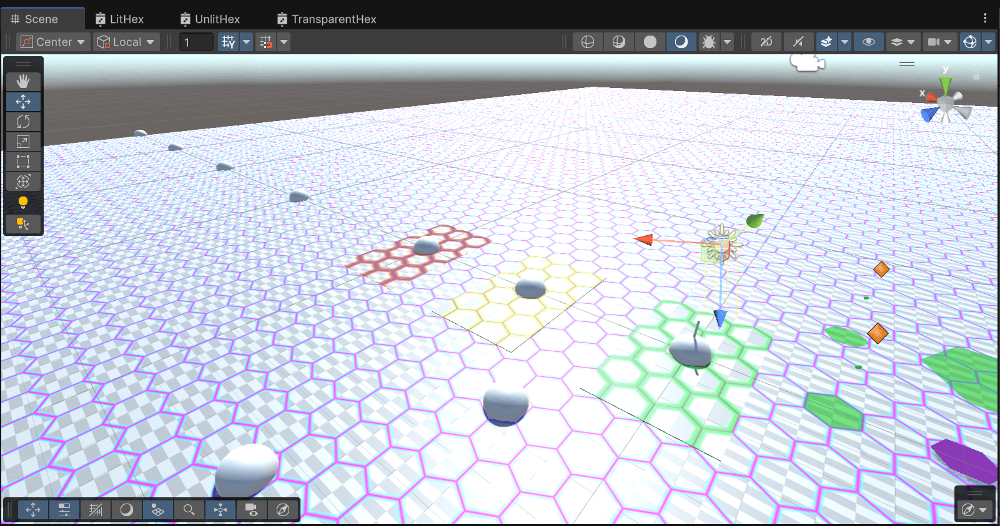

# Hex Planes

Unity package with custom shaders (and other assets) to display hexagonal grids.

## Installation

See [[install your package using its Git URL](https://docs.unity3d.com/Manual/upm-git.html)].

## Some screenshots

| Illustration | Description |
| --- | --- |
|  | Projectors scene |
|  | Materials scene with "sun" ON |
|  | Materials scene "sun" OFF |
|  | Materials scene as seen against the "sunlight" |

## More details

See [[package docs](Documentation~/net.drasmart.hexplanes)].
